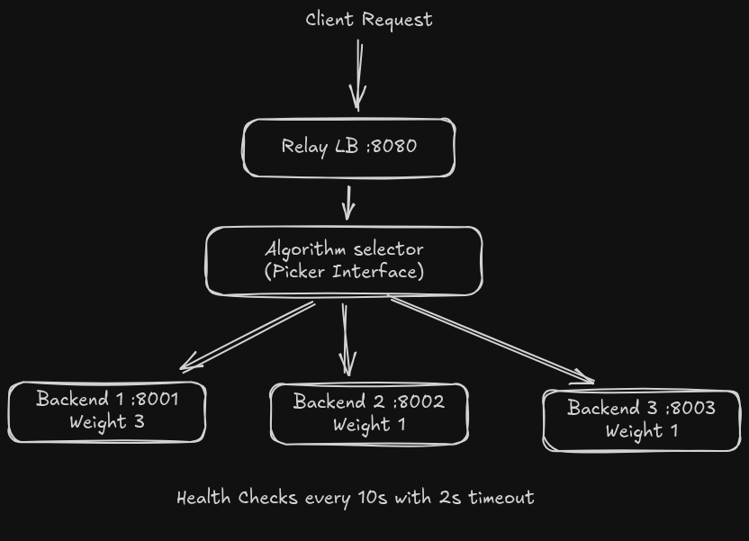

# Relay - Simple Load Balancer in Go


A lightweight HTTP load balancer built from scratch in Go with multiple algorithms.

## Features

**5 Load Balancing Algorithms**
- **Round Robin** - Equal distribution across all backends
- **Weighted Round Robin** - Priority-based distribution using weights
- **Random** - Random backend selection with failover
- **Least Connections** - Route to the backend with fewest active connections
- **IP Hash** - Consistent hashing for session persistence (sticky sessions)

**Production-Ready Features**
- Configurable health checks with automatic failover
- Graceful shutdown with signal handling
- YAML-based configuration
- Structured JSON logging
- Context-aware request routing
- Thread-safe concurrent request handling

**Developer-Friendly**
- Clean, idiomatic Go code following best practices
- Well-structured internal packages
- Easy to extend with custom algorithms
- Comprehensive benchmarks included

<details>
  <summary>Architecture</summary>


**Key Components:**
- **Pool**: Manages backend servers and health checks
- **Picker**: Strategy interface for load balancing algorithms
- **Backend**: Individual server with health status and connection tracking
- **Config**: YAML-based configuration management
</details> 

## Quick Start

### Prerequisites
- Go 1.24 or higher

### 1. Clone and Setup
```bash
git clone https://github.com/shv-ng/relay
cd relay
```

### 2. Start Backend Servers

Open separate terminals and run:
```bash
# Terminal 1
PORT=8001 go run ./cmd/server/

# Terminal 2  
PORT=8002 go run ./cmd/server/

# Terminal 3
PORT=8003 go run ./cmd/server/
```

Each server responds with:
- `GET /health` - Returns 200 OK (health check endpoint)
- `GET /` - Returns "Hello World from {port} server"

### 3. Configure Load Balancer

Create or edit `config.yml`:
```yaml
# Load Balancer Settings
port: 8080
algorithm: "weighted-round-robin"  # See algorithms below
log_file: "lb.log"

# Health Check Settings (in seconds)
health_check_interval: 10  # How often to check backend health
health_check_timeout: 2    # Timeout for each health check

# Backend Servers
backends:
  - url: "http://localhost:8001"
    weight: 3  # Gets 3x more traffic than weight-1 backends
  - url: "http://localhost:8002"
    weight: 1
  - url: "http://localhost:8003"
    weight: 1
```

<details>
    <summary>Available Algorithms:</summary>
- `round-robin` - Distributes requests evenly across all backends
- `weighted-round-robin` - Uses weight values for priority distribution
- `random` - Randomly selects backend with failover to alive servers
- `least-conn` - Routes to backend with fewest active connections
- `ip-hash` - Consistent hashing based on client IP for sticky sessions
</details>

### 4. Start Load Balancer

```bash
go run ./cmd/relay/
```

### 5. Test It
```bash
# Send requests through load balancer
curl http://localhost:8080/

# Send multiple requests to see distribution
for i in {1..10}; do curl http://localhost:8080/; done

# Load test with hey (install: go install github.com/rakyll/hey@latest)
hey -n 10000 -c 100 http://localhost:8080/
```

<details>
    <summary>Configuration Guide</summary>

### Algorithm Selection

**Round Robin** - Best for uniform workloads
```yaml
algorithm: "round-robin"
backends:
  - url: "http://localhost:8001"
  - url: "http://localhost:8002"
```

**Weighted Round Robin** - Best when servers have different capacities
```yaml
algorithm: "weighted-round-robin"
backends:
  - url: "http://powerful-server:8001"
    weight: 5  # Gets 5/7 of traffic
  - url: "http://normal-server:8002"
    weight: 2  # Gets 2/7 of traffic
```

**Least Connections** - Best for long-lived connections or varying request durations
```yaml
algorithm: "least-conn"
```

**IP Hash** - Best for session persistence (user always hits same server)
```yaml
algorithm: "ip-hash"
```

### Health Checks

Health checks automatically remove unhealthy backends from rotation:
```yaml
health_check_interval: 10  # Check every 10 seconds
health_check_timeout: 2    # Mark unhealthy if no response in 2s
```

If a backend fails health checks, it's automatically removed from the pool until it recovers.
</details>


## Benchmarks

All benchmarks performed using [hey](https://github.com/rakyll/hey) with:

```bash
hey -n 10000 -c 100 http://localhost:8080/
```

Testing environment: 3 backend servers on localhost

<details>
  <summary>Round Robin</summary>

```bash
> hey -n 10000 -c 100 http://localhost:8080/

Summary:
  Total:        2.0686 secs
  Slowest:      0.1000 secs
  Fastest:      0.0003 secs
  Average:      0.0198 secs
  Requests/sec: 4834.2872

  Total data:   290000 bytes
  Size/request: 29 bytes

Response time histogram:
  0.000 [1]     |
  0.010 [3140]  |■■■■■■■■■■■■■■■■■■■■■■■■■■■■■■■■■■■■■■■■
  0.020 [2668]  |■■■■■■■■■■■■■■■■■■■■■■■■■■■■■■■■■■
  0.030 [2021]  |■■■■■■■■■■■■■■■■■■■■■■■■■■
  0.040 [1126]  |■■■■■■■■■■■■■■
  0.050 [646]   |■■■■■■■■
  0.060 [277]   |■■■■
  0.070 [91]    |■
  0.080 [20]    |
  0.090 [8]     |
  0.100 [2]     |


Latency distribution:
  10% in 0.0035 secs
  25% in 0.0082 secs
  50% in 0.0169 secs
  75% in 0.0283 secs
  90% in 0.0407 secs
  95% in 0.0477 secs
  99% in 0.0620 secs

Details (average, fastest, slowest):
  DNS+dialup:   0.0001 secs, 0.0003 secs, 0.1000 secs
  DNS-lookup:   0.0001 secs, 0.0000 secs, 0.0178 secs
  req write:    0.0001 secs, 0.0000 secs, 0.0125 secs
  resp wait:    0.0192 secs, 0.0002 secs, 0.0999 secs
  resp read:    0.0003 secs, 0.0000 secs, 0.0130 secs

Status code distribution:
  [200] 10000 responses
```  
</details>

<details>
  <summary>Random</summary>

```bash
> hey -n 10000 -c 100 http://localhost:8080/

Summary:
  Total:        2.1078 secs
  Slowest:      0.1027 secs
  Fastest:      0.0003 secs
  Average:      0.0201 secs
  Requests/sec: 4744.2859

  Total data:   290000 bytes
  Size/request: 29 bytes

Response time histogram:
  0.000 [1]     |
  0.011 [3088]  |■■■■■■■■■■■■■■■■■■■■■■■■■■■■■■■■■■■■■■■■
  0.021 [2871]  |■■■■■■■■■■■■■■■■■■■■■■■■■■■■■■■■■■■■■
  0.031 [1943]  |■■■■■■■■■■■■■■■■■■■■■■■■■
  0.041 [1144]  |■■■■■■■■■■■■■■■
  0.051 [583]   |■■■■■■■■
  0.062 [238]   |■■■
  0.072 [84]    |■
  0.082 [35]    |
  0.092 [10]    |
  0.103 [3]     |


Latency distribution:
  10% in 0.0037 secs
  25% in 0.0085 secs
  50% in 0.0169 secs
  75% in 0.0283 secs
  90% in 0.0407 secs
  95% in 0.0481 secs
  99% in 0.0639 secs

Details (average, fastest, slowest):
  DNS+dialup:   0.0001 secs, 0.0003 secs, 0.1027 secs
  DNS-lookup:   0.0001 secs, 0.0000 secs, 0.0213 secs
  req write:    0.0001 secs, 0.0000 secs, 0.0175 secs
  resp wait:    0.0196 secs, 0.0002 secs, 0.1016 secs
  resp read:    0.0002 secs, 0.0000 secs, 0.0135 secs

Status code distribution:
  [200] 10000 responses
```  
</details>

<details>
  <summary>Weighted Round Robin</summary>

```bash
> hey -n 10000 -c 100 http://localhost:8080/

Summary:
  Total:        2.3523 secs
  Slowest:      0.1432 secs
  Fastest:      0.0004 secs
  Average:      0.0224 secs
  Requests/sec: 4251.2146

  Total data:   290000 bytes
  Size/request: 29 bytes

Response time histogram:
  0.000 [1]     |
  0.015 [4033]  |■■■■■■■■■■■■■■■■■■■■■■■■■■■■■■■■■■■■■■■■
  0.029 [3057]  |■■■■■■■■■■■■■■■■■■■■■■■■■■■■■■
  0.043 [1729]  |■■■■■■■■■■■■■■■■■
  0.058 [735]   |■■■■■■■
  0.072 [287]   |■■■
  0.086 [102]   |■
  0.100 [26]    |
  0.115 [13]    |
  0.129 [15]    |
  0.143 [2]     |


Latency distribution:
  10% in 0.0039 secs
  25% in 0.0090 secs
  50% in 0.0187 secs
  75% in 0.0317 secs
  90% in 0.0456 secs
  95% in 0.0559 secs
  99% in 0.0779 secs

Details (average, fastest, slowest):
  DNS+dialup:   0.0002 secs, 0.0004 secs, 0.1432 secs
  DNS-lookup:   0.0001 secs, 0.0000 secs, 0.0154 secs
  req write:    0.0001 secs, 0.0000 secs, 0.0245 secs
  resp wait:    0.0217 secs, 0.0003 secs, 0.1432 secs
  resp read:    0.0002 secs, 0.0000 secs, 0.0151 secs

Status code distribution:
  [200] 10000 responses

```  
</details>

<details>
  <summary>IP Hash/Sticky Sessions</summary>

```bash
> hey -n 10000 -c 100 http://localhost:8080/

Summary:
  Total:        2.1222 secs
  Slowest:      0.1173 secs
  Fastest:      0.0003 secs
  Average:      0.0202 secs
  Requests/sec: 4712.1049

  Total data:   290000 bytes
  Size/request: 29 bytes

Response time histogram:
  0.000 [1]     |
  0.012 [3417]  |■■■■■■■■■■■■■■■■■■■■■■■■■■■■■■■■■■■■■■■■
  0.024 [3194]  |■■■■■■■■■■■■■■■■■■■■■■■■■■■■■■■■■■■■■
  0.035 [1970]  |■■■■■■■■■■■■■■■■■■■■■■■
  0.047 [871]   |■■■■■■■■■■
  0.059 [313]   |■■■■
  0.070 [160]   |■■
  0.082 [46]    |■
  0.094 [23]    |
  0.106 [3]     |
  0.117 [2]     |


Latency distribution:
  10% in 0.0042 secs
  25% in 0.0090 secs
  50% in 0.0172 secs
  75% in 0.0281 secs
  90% in 0.0397 secs
  95% in 0.0482 secs
  99% in 0.0688 secs

Details (average, fastest, slowest):
  DNS+dialup:   0.0001 secs, 0.0003 secs, 0.1173 secs
  DNS-lookup:   0.0001 secs, 0.0000 secs, 0.0279 secs
  req write:    0.0001 secs, 0.0000 secs, 0.0119 secs
  resp wait:    0.0197 secs, 0.0002 secs, 0.1172 secs
  resp read:    0.0003 secs, 0.0000 secs, 0.0101 secs

Status code distribution:
  [200] 10000 responses

```  
</details>

<details>
  <summary>Least Count</summary>

```bash
> hey -n 10000 -c 100 http://localhost:8080/

Summary:
  Total:        2.3649 secs
  Slowest:      0.1343 secs
  Fastest:      0.0003 secs
  Average:      0.0225 secs
  Requests/sec: 4228.4218

  Total data:   290000 bytes
  Size/request: 29 bytes

Response time histogram:
  0.000 [1]     |
  0.014 [3806]  |■■■■■■■■■■■■■■■■■■■■■■■■■■■■■■■■■■■■■■■■
  0.027 [2770]  |■■■■■■■■■■■■■■■■■■■■■■■■■■■■■
  0.041 [1933]  |■■■■■■■■■■■■■■■■■■■■
  0.054 [975]   |■■■■■■■■■■
  0.067 [346]   |■■■■
  0.081 [104]   |■
  0.094 [44]    |
  0.108 [15]    |
  0.121 [3]     |
  0.134 [3]     |


Latency distribution:
  10% in 0.0040 secs
  25% in 0.0088 secs
  50% in 0.0190 secs
  75% in 0.0328 secs
  90% in 0.0456 secs
  95% in 0.0543 secs
  99% in 0.0744 secs

Details (average, fastest, slowest):
  DNS+dialup:   0.0001 secs, 0.0003 secs, 0.1343 secs
  DNS-lookup:   0.0001 secs, 0.0000 secs, 0.0279 secs
  req write:    0.0001 secs, 0.0000 secs, 0.0196 secs
  resp wait:    0.0218 secs, 0.0003 secs, 0.1233 secs
  resp read:    0.0004 secs, 0.0000 secs, 0.0231 secs

Status code distribution:
  [200] 10000 responses

```  
</details>

**Key Observations:**
- All algorithms handle 10k requests efficiently (~2-2.4 seconds)
- Round Robin and Random perform similarly (~4,700-4,800 req/sec)
- IP Hash provides consistent performance with session affinity
- Weighted Round Robin and Least Connections have slightly higher latency due to additional selection logic
- All algorithms successfully handle 100 concurrent connections

## Why This Project?

This project was built to demystify load balancing by implementing it from scratch. It demonstrates:
>  **Read the deep dive:** I wrote a detailed blog post on [Building a Simple Load Balancer from Scratch in Go](https://medium.com/@shv-ng/building-a-simple-load-balancer-from-scratch-in-go-819438c50b63) which explains the architecture and implementation details of this project.

- **Core Infrastructure Patterns**: Health checks, graceful shutdown, concurrent request handling
- **Go Best Practices**: Interfaces, context usage, atomic operations, structured concurrency
- **Algorithm Implementation**: Five different load balancing strategies with real-world tradeoffs
- **Production Concerns**: Configuration management, logging, error handling, failover

Perfect for:
- Understanding how nginx, HAProxy, and cloud load balancers work internally
- Learning Go's concurrency primitives and HTTP server capabilities
- Comparing algorithm performance with real benchmarks
- Building a foundation for distributed systems knowledge

<details>
    <summary>Project Structure</summary>

```
relay/
├── cmd/
│   ├── relay/          # Load balancer entry point
│   │   └── main.go
│   └── server/         # Test backend server
│       └── main.go
├── internal/
│   ├── algo/           # Load balancing algorithms
│   │   ├── algo.go               # Picker interface
│   │   ├── round_robin.go
│   │   ├── weighted_round_robin.go
│   │   ├── random.go
│   │   ├── least_connection.go
│   │   └── ip_hash.go
│   ├── backend/        # Backend server management
│   │   └── backend.go
│   ├── pool/           # Server pool orchestration
│   │   └── pool.go
│   └── config/         # Configuration handling
│       └── config.go
├── config.yml          # Load balancer configuration
├── go.mod
└── README.md
```
</details>

## Development

### Add a New Algorithm

1. Create a new file in `internal/algo/` (e.g., `my_algorithm.go`)
2. Implement the `Picker` interface:
```go
type myAlgorithm struct {
    backends []*backend.Backend
}

func NewMyAlgorithm() Picker {
    return &myAlgorithm{}
}

func (m *myAlgorithm) Init(backends []*backend.Backend) {
    m.backends = backends
}

func (m *myAlgorithm) Next(ctx context.Context) *backend.Backend {
    // Your selection logic here
}
```
3. Register in `cmd/relay/main.go` in the `getAlgo()` function
4. Use in `config.yml`: `algorithm: "my-algorithm"`


## Known Limitations

- No persistent connection pooling (creates new connections per request)
- Log rotation not implemented (logs grow indefinitely)
- No metrics/monitoring endpoint (planned for future)
- No support for HTTPS backends yet
- Health check endpoint is fixed to `/health`

## Contributing

This is a learning project, but contributions are welcome! Feel free to:

- Add new load balancing algorithms
- Improve existing implementations
- Add tests and benchmarks
- Enhance documentation
- Report bugs or suggest features via issues

## License

MIT License - see  file for details

## Acknowledgments

Built with ❤️ to understand Go and distributed systems.

---

If you found this helpful for learning, please ⭐ the repo!
